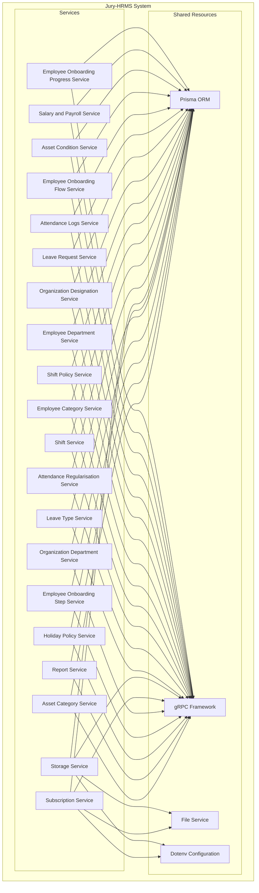

    

    <b>Automatic Architecture Diagrams from Code</b> 
    <a href="https://github.com/swark-io/swark">GitHub</a> • <a href="https://swark.io">Website</a> • <a href="mailto:contact@swark.io">Contact Us</a>

## Usage Instructions

1. **Render the Diagram**: Use the links below to open it in Mermaid Live Editor, or install the [Mermaid Support](https://marketplace.visualstudio.com/items?itemName=bierner.markdown-mermaid) extension.
2. **Recommended Model**: If available for you, use `claude-3.5-sonnet` [language model](vscode://settings/swark.languageModel). It can process more files and generates better diagrams.
3. **Iterate for Best Results**: Language models are non-deterministic. Generate the diagram multiple times and choose the best result.

## Generated Content
**Model**: GPT-4o - [Change Model](vscode://settings/swark.languageModel)  
**Mermaid Live Editor**: [View](https://mermaid.live/view#pako:eNqNVstu4zAM_BXB5_YHcligSLYoFi0S2L3Fe1BtRhHWlryU3MJb9N_Xj9jR0-nJMTmiSM6QzmdSyBKSTZILhrQ5k9ddLghR7dv0-qvF7v4pfclI1ikN9eA03BngOy9ATWZCoG724k1SLLlgB5QMQakL6PizbirZAZArhMyYOdLvOZKiFcXuQZQH2qGsqjlINtoJFSW5eLyjVCnQWylKrrkU88GHwUoWs3fKSv2xkh9raQ9-_16tQZRUFPAs2VL1w2Ilg9k7VQF9hxT-tqD0fOZ5sJGL0Tshke1AcSaoWd8eGRX832gjhj9U6A4airoGob0iry6fkjM_6YOseNEtbAwmMtlCF40xt1QDk9h5d82O8E32HfFmp8DaXhNcWe0w2m4DwgS8dg3Y3R8sfmJaImULMptefVj7pgrkjZlQZtjClLqcOIxGebGUm2lo1pQ7-L0I557AknY2t0-TMcYuQiNxyTUd3yKj6PB_mcQw-T1puXC3zJkilD2PSrZobJum57Smx8P4IPv0ZbmXYVMcWXrYkkekNXxI_LP4Stkr4_24Gx_DQjhx1uLY5QVz4tVC8mP_O57k2sYj9_c_xlQu9YRXmoMKbi8HE9tVbqjQQnIwgfXjIILrxk_I069bvbc9_BihdREKc6vc4EoIFW6MvXuPNemu05_vUNPWGxIbWwcWmk0HYo1iUE7Rln5TxNOk3ZaxiYsL2UStStkKFxWziYrJ2cTEBe0kFmbQ6kVY1E6cqKy9ULeLj0vba4Mrbus2X96WOyJwr423GrQqchMYlbkJ8oXuC26lzdHSjXW_Xr8P9INN35f1OFfM-ClJ7pIasKa87P-Jf-aJPkMNebIheVLCibaVzpOvHtQ2ZV_ejtP-u1gnG40t3CW01TLrRDG_o2zZOdmcaKXg6z9jtSvS) | [Edit](https://mermaid.live/edit#pako:eNqNVstu4zAM_BXB5_YHcligSLYoFi0S2L3Fe1BtRhHWlryU3MJb9N_Xj9jR0-nJMTmiSM6QzmdSyBKSTZILhrQ5k9ddLghR7dv0-qvF7v4pfclI1ikN9eA03BngOy9ATWZCoG724k1SLLlgB5QMQakL6PizbirZAZArhMyYOdLvOZKiFcXuQZQH2qGsqjlINtoJFSW5eLyjVCnQWylKrrkU88GHwUoWs3fKSv2xkh9raQ9-_16tQZRUFPAs2VL1w2Ilg9k7VQF9hxT-tqD0fOZ5sJGL0Tshke1AcSaoWd8eGRX832gjhj9U6A4airoGob0iry6fkjM_6YOseNEtbAwmMtlCF40xt1QDk9h5d82O8E32HfFmp8DaXhNcWe0w2m4DwgS8dg3Y3R8sfmJaImULMptefVj7pgrkjZlQZtjClLqcOIxGebGUm2lo1pQ7-L0I557AknY2t0-TMcYuQiNxyTUd3yKj6PB_mcQw-T1puXC3zJkilD2PSrZobJum57Smx8P4IPv0ZbmXYVMcWXrYkkekNXxI_LP4Stkr4_24Gx_DQjhx1uLY5QVz4tVC8mP_O57k2sYj9_c_xlQu9YRXmoMKbi8HE9tVbqjQQnIwgfXjIILrxk_I069bvbc9_BihdREKc6vc4EoIFW6MvXuPNemu05_vUNPWGxIbWwcWmk0HYo1iUE7Rln5TxNOk3ZaxiYsL2UStStkKFxWziYrJ2cTEBe0kFmbQ6kVY1E6cqKy9ULeLj0vba4Mrbus2X96WOyJwr423GrQqchMYlbkJ8oXuC26lzdHSjXW_Xr8P9INN35f1OFfM-ClJ7pIasKa87P-Jf-aJPkMNebIheVLCibaVzpOvHtQ2ZV_ejtP-u1gnG40t3CW01TLrRDG_o2zZOdmcaKXg6z9jtSvS)

